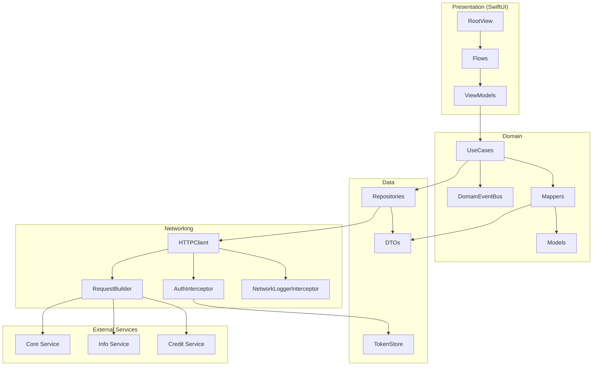

```mermaid
graph TD

subgraph Presentation["Presentation (SwiftUI)"]
  RootView --> Flows
  Flows --> ViewModels
end

subgraph Domain["Domain"]
  UseCases
  Models
  Mappers
  DomainEventBus
end

subgraph Data["Data"]
  Repositories
  DTOs
  TokenStore
end

subgraph Networking["Networking"]
  HTTPClient
  RequestBuilder
  AuthInterceptor
  NetworkLoggerInterceptor
end

subgraph ExternalServices["External Services"]
  CoreService["Core Service"]
  InfoService["Info Service"]
  CreditService["Credit Service"]
end

%% dependencies
ViewModels --> UseCases
UseCases --> Repositories
UseCases --> DomainEventBus

Repositories --> HTTPClient
Repositories --> DTOs

Mappers --> DTOs
Mappers --> Models
UseCases --> Mappers

HTTPClient --> RequestBuilder
HTTPClient --> AuthInterceptor
HTTPClient --> NetworkLoggerInterceptor
AuthInterceptor --> TokenStore

RequestBuilder --> CoreService
RequestBuilder --> InfoService
RequestBuilder --> CreditService
```
