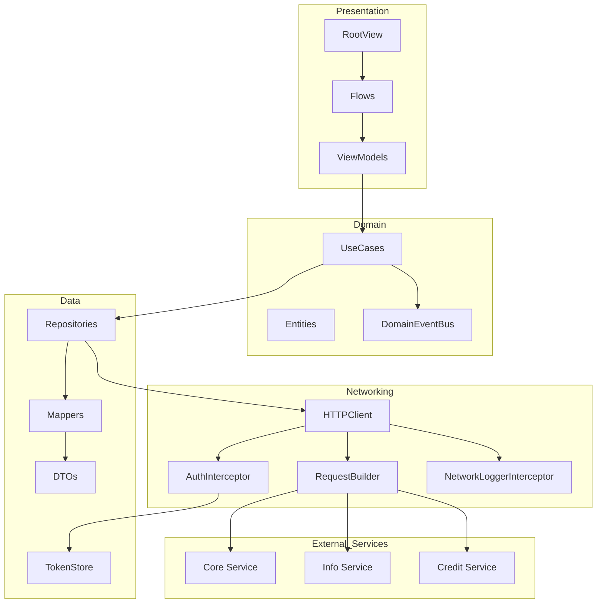

```mermaid
graph TD

subgraph Presentation
  RootView --> Flows
  Flows --> ViewModels
end

subgraph Domain
  UseCases
  Entities
  DomainEventBus
end

subgraph Data
  Repositories
  Mappers
  DTOs
  TokenStore
end

subgraph Networking
  HTTPClient
  RequestBuilder
  AuthInterceptor
  NetworkLoggerInterceptor
end

subgraph External_Services
  CoreService[Core Service]
  InfoService[Info Service]
  CreditService[Credit Service]
end

ViewModels --> UseCases
UseCases --> Repositories
UseCases --> DomainEventBus

Repositories --> HTTPClient
Repositories --> Mappers
Mappers --> DTOs

HTTPClient --> RequestBuilder
HTTPClient --> AuthInterceptor
HTTPClient --> NetworkLoggerInterceptor
AuthInterceptor --> TokenStore

RequestBuilder --> CoreService
RequestBuilder --> InfoService
RequestBuilder --> CreditService
```
