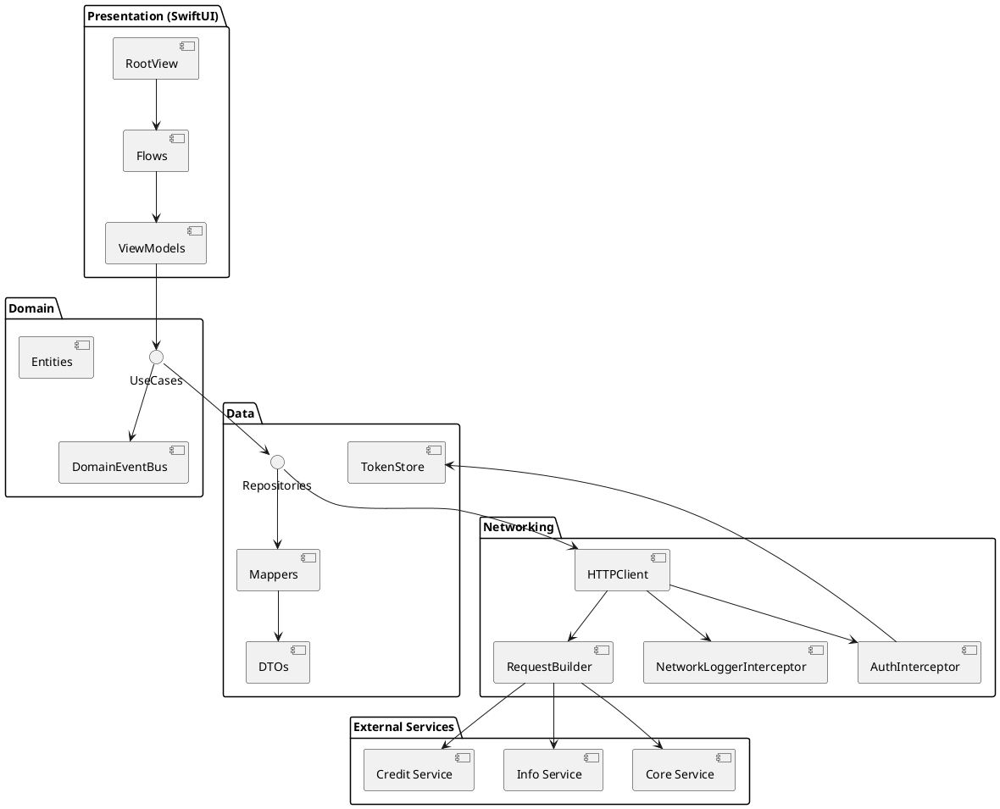

# Racoon-Employee
<pre>

```plantuml
@startuml

package "Presentation (SwiftUI)" {
  [RootView] --> [Flows]
  [Flows] --> [ViewModels]
}

package "Domain" {
  interface "UseCases" as UC
  [Entities]
  [DomainEventBus]
}

package "Data" {
  interface "Repositories" as REPO
  [Mappers]
  [DTOs]
  [TokenStore]
}

package "Networking" {
  [HTTPClient]
  [RequestBuilder]
  [AuthInterceptor]
  [NetworkLoggerInterceptor]
}

package "External Services" {
  [Core Service]
  [Info Service]
  [Credit Service]
}

[ViewModels] --> UC
UC --> REPO
UC --> [DomainEventBus]

REPO --> [HTTPClient]
REPO --> [Mappers]
[Mappers] --> [DTOs]

[HTTPClient] --> [RequestBuilder]
[HTTPClient] --> [AuthInterceptor]
[HTTPClient] --> [NetworkLoggerInterceptor]
[AuthInterceptor] --> [TokenStore]

[RequestBuilder] --> [Core Service]
[RequestBuilder] --> [Info Service]
[RequestBuilder] --> [Credit Service]

@enduml
```
</pre>
